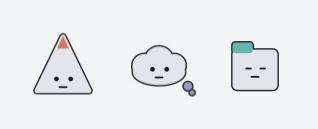

# 마당 (madang)

**역할이 다른 여러 에이전트가 동시에 뛰고, 파일 신호로 조율되고, 그 상태가 눈에 보이는 Claude Code 팀.**



터미널 탭마다 페르소나를 가진 에이전트 세션을 띄우고(팀장 1 + 팀원 N), 브리프·컨펌을 파일로 주고받는 **탭 모드** 협업 시스템이다. 각 탭이 지금 뭘 하는지는 화면 위의 워커 오버레이(마당)가 보여준다 — 호박(컨펌 대기·논의)은 팀장이 처리하면 되는 상태, 적(사용자 대기)은 사용자 본인만 풀 수 있는 상태, 눈을 뜨고 있으면(안광 유지) 깨어서 활동 중, 눈 감음은 쉼이다.

> **기원.** 이 팀은 2026년 7월 포켓몬 이름을 붙인 네 에이전트로 시작했다. 공개(2026-09)를 준비하면서 이름·그림·인사말을 전부 자작 마스코트로 바꿨다 — 남의 캐릭터 위에 브랜드를 쌓으면 잘될수록 남의 것이 되고, 확산 라이선스도 붙일 수 없어서다. 이 프로젝트는 포켓몬컴퍼니·닌텐도와 무관하며 그 상표·그림을 쓰지 않는다. 이름 바꾼 이야기는 `plans/brand-strategy-2026-09-03.md`.

## 왜

혼자 Claude Code를 쓰면 두 가지가 자주 걸린다 — 긴 작업이 도는 동안 지금 뭘 하고 있는지 화면 밖에서는 안 보이고, 검증 없이 커밋이 바로 나간다. 이 시스템은 그 둘을 파일 신호로 푼다: 워커 오버레이가 각 세션의 상태를 항상 눈에 띄게 보여주고, 커밋 게이트 훅이 팀장의 APPROVE 없이는 커밋을 막는다. 역할을 나눠 병렬로 굴리는 건 그 위에 얹은 덤이다.

> 초안 — 사용자가 다듬는다는 전제로 몽글이 썼다.

## 로스터

| | 이름 | 세션 | 언제 부르나 | 인사 |
|---|---|---|---|---|
| ⚪ | 도담 · 팀장 | `/teamleader` | 사람이 직접 대화 — 브리프 배분, 보고 git 교차검증, 허브 문서(TASKS/PROGRESS) 단일 작성 | — |
| 🔺 | 번뜩 | `/solver` | **깊이** — 하나의 어려운 문제를 끝까지. 핵심 슬라이스, 2회 실패한 버그, 통합·재현 불가·아키텍처급 | 번뜩! |
| ☁️ | 몽글 | `/builder` | **넓이** — 같은 모양의 독립 태스크 N개를 병렬로. 분신(몽글2·3)으로 나뉜다 | 몽글~ |
| 🟦 | 슥슥 | `/sketcher` | **시안** — 화면이 필요할 때. worktree 격리에서 프로토타입, 스크린샷 후보 → 확정안만 메인 반영 | 슥슥~ |
| 💬 | 조잘 | `/narrator` | **해설** — 사용자가 이해하고 싶을 때. 팀 문서를 감시하며 비개발자에게 쉽게 설명 (읽기 전용) | 조잘조잘! |

이름·인사말·이모지·색의 단일 원천은 `claude/roster.json`(스킨 표), 그림은 `claude/assets/mascots/`(CC BY 4.0, `BRANDING.md`).

## 핵심 개념

- **탭 모드**: 사람이 터미널 탭을 열어 팀원 세션을 기동(사람 개입은 탭당 시작 프롬프트 1회). 브리프는 `.claude/team/briefs/{인스턴스}.md` 파일 폴링으로 자동 수령.
- **컨펌 신호 프로토콜**: 커밋 전 팀원이 `.claude/team/confirm/{인스턴스}.request.md`(CONFIRM/BLOCKED/DISCUSS) 작성 → 팀장이 백그라운드 감시로 감지·검증 → `reply.md`(APPROVE/FIX)로 응답.
- **기술 주체성**: 팀원은 공식문서로 브리프를 선검증하고, 세부 판단은 자율, 브리프와 충돌하면 `DISCUSS`로 논의.
- **커밋 게이트 훅**: 번뜩·몽글·슥슥 세션은 페르소나 frontmatter 훅으로 `git commit`을 차단 — **자기 인스턴스의** APPROVE reply 또는 팀장이 만든 `commit-waiver` 파일이 있을 때만 통과(슥슥 `[proto]` 실험 커밋은 예외). 허브 문서(TASKS/PROGRESS) 수정 차단 훅은 전 팀원 적용. ("훅이 강제, 스킬이 안내")
- **프로젝트 애든덤**: 프로젝트별 상시 특화는 `{프로젝트}/.claude/team/agents/{이름}.md`에 두면 기력회복 시 베이스 정의 위에 겹쳐 적용(델타만, 통째 오버라이드 금지).
- **워커 오버레이 `madang`**: `.claude/team/` 파일 신호와 워커 세션 기록(모델이 실제로 산출한 턴)만 읽어 상태를 보여준다. 읽기 전용이라 워커 배관을 건드리지 않는다. 평소엔 글자가 없고, 사람이 행동해야 할 때만 말풍선이 뜬다. `go-madang`(프로젝트 루트) — 상세 `claude/tools/madang/README.md`.
- 상세 규칙: `claude/skills/teamleader/ways-of-working.md` · 방향·로드맵·브랜드 결정: `DIRECTION.md`

## 스킬 한눈에

세션 진입은 전부 `/이름` 명시 호출. 팀장 커맨드는 팀장 전용(`disable-model-invocation`).

**페르소나 세션 (`claude/skills/{이름}/` + `claude/agents/{이름}.md`)**

| 스킬 | 한 줄 |
|---|---|
| `/teamleader` | 팀장 모드 — 배분·보고 git 교차검증·허브 문서 단일 작성. 빈 프로젝트면 `/start` 안내 |
| `/solver` | 번뜩 세션 시작 — 깊이(난제 하나를 끝까지 + 에스컬레이션 디버깅) |
| `/builder` | 몽글 세션 시작 — 넓이(같은 모양 N개 병렬, 분신) |
| `/sketcher` | 슥슥 세션 시작 — 시안(UX/UI 프로토타이핑, worktree 격리) |
| `/narrator` | 조잘 세션 시작 — 해설(읽기 전용, 비개발자 눈높이) |

**팀장 커맨드 (`claude/skills/{이름}/`)**

| 스킬 | 한 줄 |
|---|---|
| `/start` | 새 스토리/에픽 착수 — 팀 폴더 스캐폴딩 + Phase 설계 + 브리프 초안 + PROGRESS 초기화 |
| `/checkpoint` | PROGRESS.md 현행화 (체크포인트·세션 종료) |
| `/progress` | PROGRESS/TASKS 기반 상태 브리핑 (읽기 전용) |
| `/issue-fetch` | 이슈 1회 조회 → `.claude/stories/` 로컬 캐시 (읽기 전담) |
| `/issue-refine` | 이슈 구체화·분할(착수 전) / 구현 기록·상태 전환(PR 머지 후) |
| `/issue-add` | 버그(스프린트)·아이디어(백로그) 빠른 등록 |
| `/skill-audit` | 스킬 인벤토리 전수 스캔 → `~/.claude/REGISTRY.md` 현행화 (월 1회/스프린트 종료) |

> 이슈 커맨드 3종은 프로젝트의 `.claude/team/tracker-config.md`(트래커 종류·도메인·Key)를 읽어 동작 — 베이스엔 회사 정보 없음. 다른 프로젝트는 그 파일만 새로 쓰면 재사용.

**팀장 구동 문서 (`claude/skills/teamleader/`)**: `roster`(명부) · `ways-of-working`(운영 규칙 — 규칙만; 변경 이력은 `ways-of-working-changelog`, 사고 경위·실측은 `reference/incidents`) · `model-guide`(모델 배분) · `skill-guide`(역할×시점 스킬 매핑).

## 설치

**방법 1 — 심링크 (주 사용 기기, 수정하며 쓸 때)**

```bash
git clone https://github.com/janjanjae/madang.git && cd madang
./install.sh   # ~/.claude에 심링크 생성 (~/.copilot은 있을 때만, 기존 파일은 .bak 백업)
echo 'source '"$PWD"'/claude/shell/go-functions.zsh' >> ~/.zshrc && exec zsh
```

설치 스크립트는 심링크만 만든다 — `go-solver`·`go-builder`·`go-madang` 같은 명령은 위 마지막 한 줄로 생긴다. Copilot을 나중에 설치했으면 `./install.sh`를 다시 실행한다(재실행 무해, `~/.copilot` 심링크만 추가로 생긴다).

**방법 2 — 플러그인 (다른 기기·클라우드 세션, 읽기 전용 사용)**

```
/plugin marketplace add janjanjae/madang
/plugin install madang
```

플러그인 설치 시 커맨드는 `/madang:start`처럼 네임스페이스가 붙는다. 두 방법 병행 가능 — 같은 기기에선 심링크(로컬 파일)가 우선한다.

이후 `~/.claude/...`를 편집하면 그대로 이 레포의 워킹트리 변경이 된다 — 커밋만 하면 팀 시스템이 버전 관리된다.

## 구조

```
DIRECTION.md            # 팀 시스템의 방향 (비전·설계 원칙·로드맵·브랜드 결정) — 여기부터 읽기
BRANDING.md             # 이름·마스코트 사용 규칙 (CC BY 4.0)
LICENSE                 # 코드 MIT
.claude-plugin/         # 마켓플레이스 매니페스트 (플러그인 설치용)
claude/
  roster.json           # 스킨 표 — 이름·인사말·이모지·색의 단일 원천
  assets/mascots/       # 마스코트 SVG (rest/smile/sleep × light/dark)
  agents/               # 팀원 페르소나 (solver, builder, sketcher, narrator)
  skills/               # 페르소나 세션 스킬 + teamleader(구동 문서 4종) + 팀장 커맨드 스킬
  skills/teamleader/hooks/   # 커밋 게이트·허브 문서 보호·컴팩션 후 규칙 재주입 훅
  shell/go-functions.zsh     # 탭 기동 함수 go-solver / go-builder / go-sketcher / go-narrator / go-teamleader / go-madang
  tools/madang/         # 워커 오버레이 (AppKit 단일 파일 Swift, swiftc만 있으면 빌드)
plans/                  # 감사 리포트·설계 스냅샷 (결론은 DIRECTION으로 승격)
copilot/
  skills/sync_claude_team/   # Claude → Copilot 단방향 설정 동기화 (manifest 기반 의미 번역)
install.sh              # ~/.claude 심링크 (~/.copilot은 있을 때만)
CONTRIBUTING.md         # 커밋 규칙
.githooks/              # commit-msg 강제
.gitmessage             # 커밋 템플릿
```

## 위치 (4계층 중 "베이스")

이 레포는 개인 AI 환경 4계층(내장 → 개인 → **베이스** → 오버레이) 중 **베이스**다 — 프로젝트 불문 팀 시스템. 개인 계층은 별도 비공개 레포, 프로젝트 특화는 각 프로젝트 `.claude/`(오버레이).

## 라이선스

코드는 **MIT**(`LICENSE`), 오리지널 마스코트(`claude/assets/**`)는 **CC BY 4.0**(`BRANDING.md`). 저작권자는 잔잔재(janjanjae).

## In English

**madang** ("courtyard" in Korean) is a Claude Code setup for running a team of agents with distinct roles in parallel terminal tabs: one lead plus four teammates — solver (depth: one hard problem at a time), builder (breadth: many similar tasks, with clones), sketcher (UI prototypes in isolated worktrees) and narrator (read-only explainer). Coordination is file-based: briefs, confirm requests and replies are plain Markdown under `.claude/team/`, and a commit-gate hook enforces the review protocol. A small always-on-top worker overlay renders each teammate's live state from those files and from the session transcripts, so you can tell at a glance who is waiting for you. Mascots are original and CC BY 4.0. Docs are in Korean; the roster table above maps the names.

```bash
git clone https://github.com/janjanjae/madang.git && cd madang
./install.sh
echo 'source '"$PWD"'/claude/shell/go-functions.zsh' >> ~/.zshrc
```

Code is MIT; the original mascots are CC BY 4.0.

---

made by **잔잔재** (janjanjae) · 개인 운영 중 · 이슈·PR 환영, 단 페르소나 추가 PR은 받지 않는다(마스코트 일관성 유지 — 스킨 교체는 `roster.json`으로).
